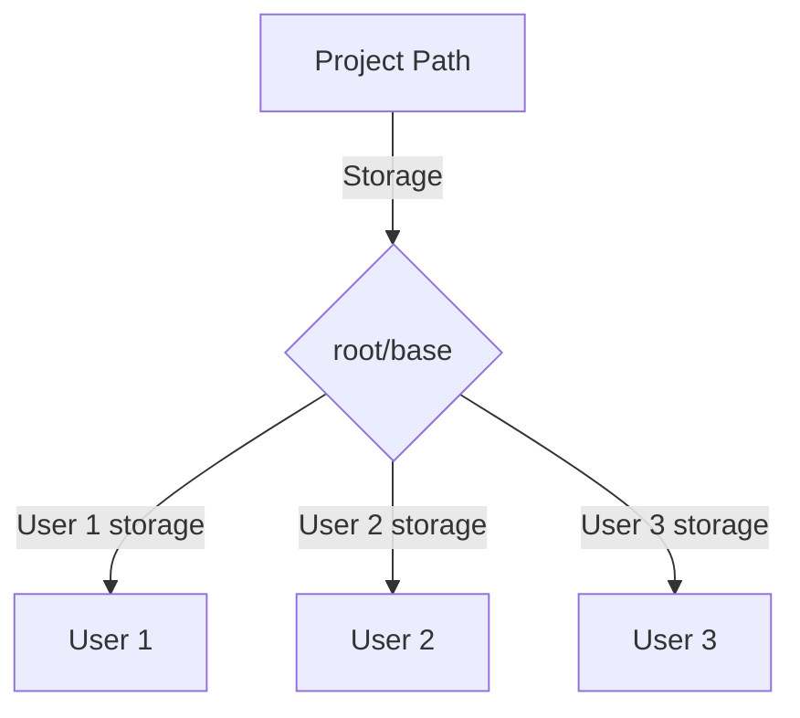

# Network Cloud Drive

Local network storage API that can store files and manage them. Uses SQLite for retrieving files and finding paths fast

[FEATURES](FEATURES.md)

## Future plans
- React based Frontend for Desktop and iOS/Android phones
- Routinely syncing database with filesystem and a way to force a resync

# Run

- [Using Containers (Docker)](DOCKER/DOCKER.md)
- [Using Artifacts binaries](ARTIFACT.md)

# Configuration

application.properties configurations can be overridden by creating file at ./config/application.properties

Example configurations:
- Configure CORS
- Enable HTTP Basic Authentication
- Enable logging debug level
- Disable CSRF Protection
- Change Springboot port

... and more

## File Structure Visual

